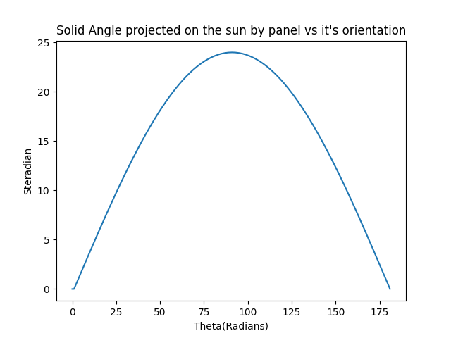
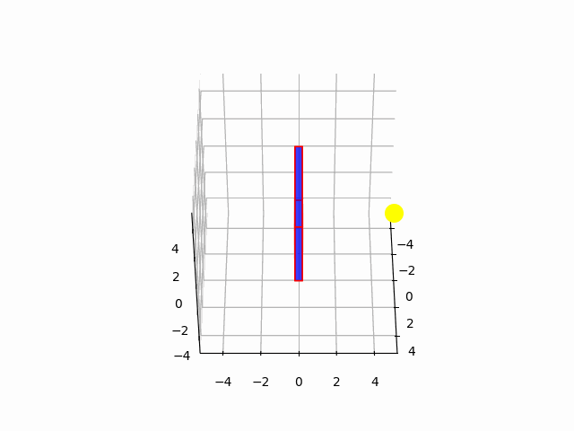

# Solar Panel Controller

This project is currently work in progress

The current controller measures the solid angle projected by sun (which can be directly inferred from the energy produced) if the measured angle is lesser than any of the previous encountered angles then the conroller takes a step update to maximize the projected solid angle. On estimating the solid angle the controller discritizes the panel_angle to mimic the effect of an actual actuator

This method works because the solid angle projected by the panel onto the sun is a concave function of the panel angle

### Simulation of Solar Panel Rotating along with Sun with different controller settings

 0.1            |   0.33 | 0.5 | 0.66 | 1
:-------------------------:|:-------------------------:|:-------------------------:|:-------------------------:|:-------------------------:
  |   |  |   | 
